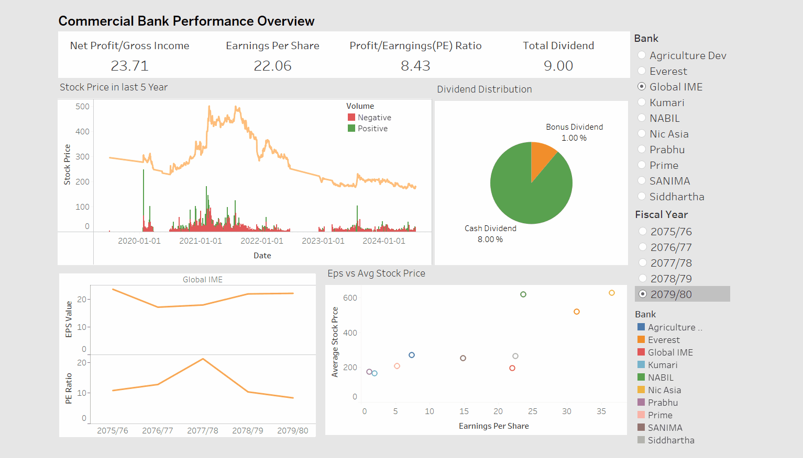
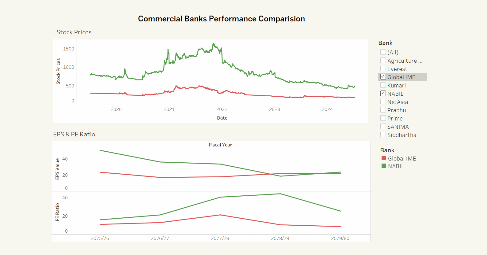

# Commercial Banks Performance Analysis

## Overview
This study aims to provide a comprehensive analysis of the performance of commercial banks in Nepal. The main objective is to evaluate and compare key financial metrics and stock price behaviors across different banks to gain insights into their financial health and market performance. This analysis is intended to assist stakeholders in making informed decisions regarding investments and financial strategies within the banking sector. The dashboards provide visualizations to help compare and understand the performance trends of these banks.

The analysis focuses on the following top 10 banks: Global IME Bank, NABIL Bank, NIC Asia Bank, Siddhartha Bank, Prabhu Bank, Kumari Bank, Prime Bank , Sanima Bank, Everest Bank, and Agricultural Development Bank

## Demo

## Raw Data
The raw data is categorized into two main types:

### 1. Major Indicators
Each CSV file in this category contains metrics for a specific bank over different fiscal years.  The source of this data is the annual reports of the banks.

### 2. Share Prices
Each CSV file in this category contains stock prices for a specific bank over the last 5 years. The source of this data is the NEPSE (Nepal Stock Exchange) website.

## Final Cleaned Data
The cleaned and consolidated data is organized into two final CSV files:

- **Final Indicators**: This file combines all the metrics data for all banks.
- **Final Stock Price**: This file combines all the stock price data for all banks.

## Dashboards
Above data are analyzed and two main dashboards are built with the help of tableau:

### 1. Commercial Banks Performance Overview
This dashboard provides an overview of the performance of individual commercial banks, showing metrics such as Net Profit/Gross Income, Earnings Per Share, PE Ratio, Total Dividend, Stock Price trends, and Dividend Distribution.

### 2. Commercial Banks Performance Comparison
This dashboard allows for a comparison between different commercial banks, highlighting metrics such as EPS Value, PE Ratio, and Stock Price trends across different fiscal years.

